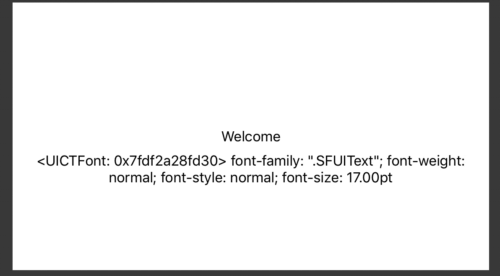

#  AdaptiveStringsSample

## Modifications from original repo

* Switched label to using dynamic body style font
* Move label configuration to `traitCollectionDidChange(_:)`
* Opt welcome label into automatic dynamic font sizing
* Added label for displaying the current font info

## Original Readme

This project is a very simple example that shows how to use adaptive width string localization on iOS apps.

Simply run the project on an iPhone 5s, iPhone 6, or iPad Pro and you will see different Spanish welcome messages depending on the device size.

## Author

Daniel Martín https://www.cocoaengineering.com
